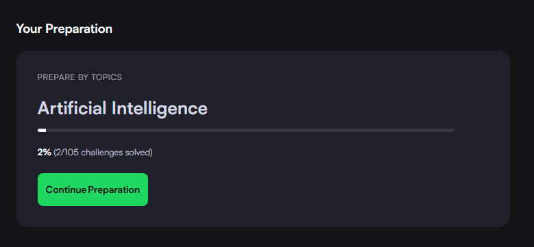
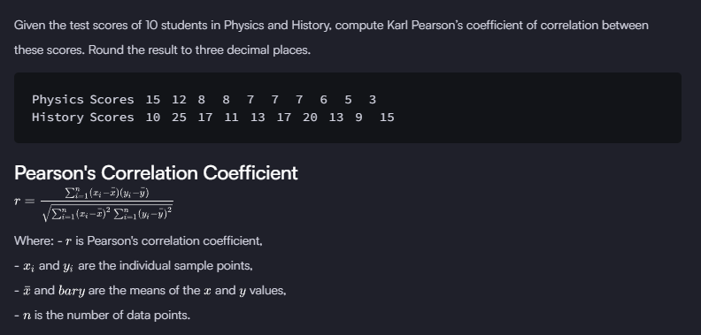
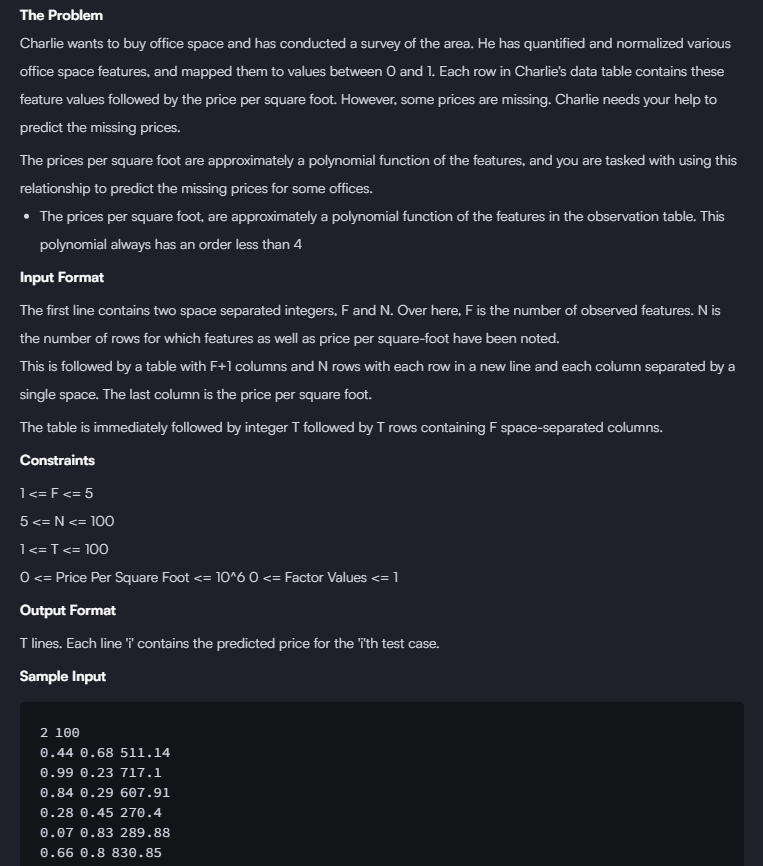
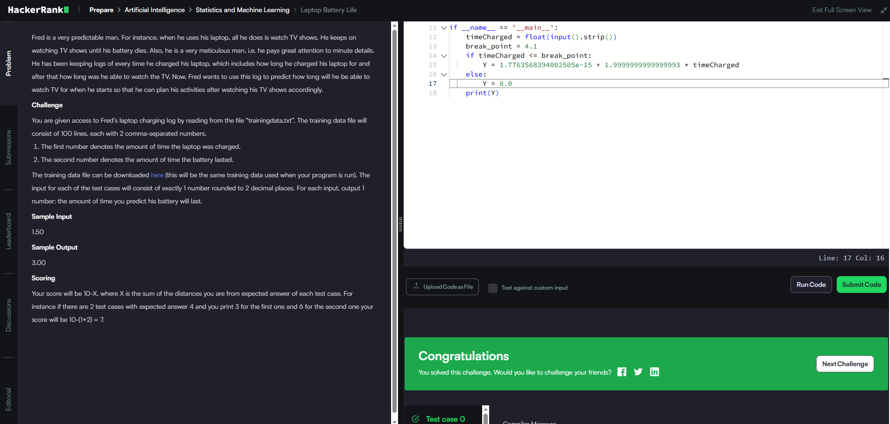
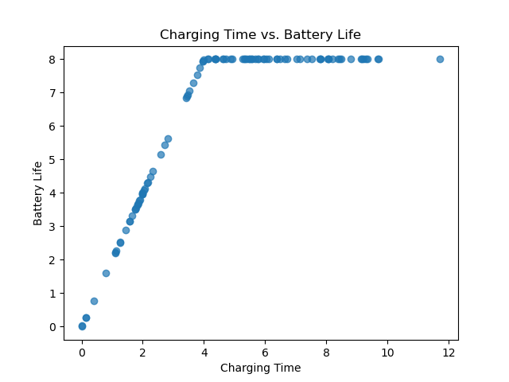

# HackerRankTopics
Solutions to differents topics routes on Hacker Rank

## What's the point?
Be a better programmer on differents topics of interest, like artificial intelligence, computer science ...

## Artificial Intelligence

### Multiple Linear Regression : Prediction House Prices
#### Problem

#### Solution [cpp solution](2025/Artificial_Intelligence/MultipleLinearRegression_PredictingHousePrices.cpp)

### Polynomial Regression: Office Prices
#### Problem

#### Solution [Python solution](2025/Artificial_Intelligence/PolynomialRegressionOfficePrices.py)
* Using Polynomial transform of 3 grade on a regression model

### Laptop Battery Life
* Fun problem, you need to see the relationship between the variables and next create a model for a specific break point. May be create a model is overcomplex the problem.
#### Problem

#### Solution [Python Solution](2025/Artificial_Intelligence/LaptopBatteryLife/model.py)
* The problems give us data, so:
    * Study the data
    
    

    * train a model
    * And finally obtain the `reg.intercept_` and `reg.coef_` for build the equation: $Y = \alpha + \beta \cdot X$ and get the answer.

### Stock Predictions
* Problem: https://www.hackerrank.com/challenges/stockprediction?isFullScreen=true&hr_b=1
